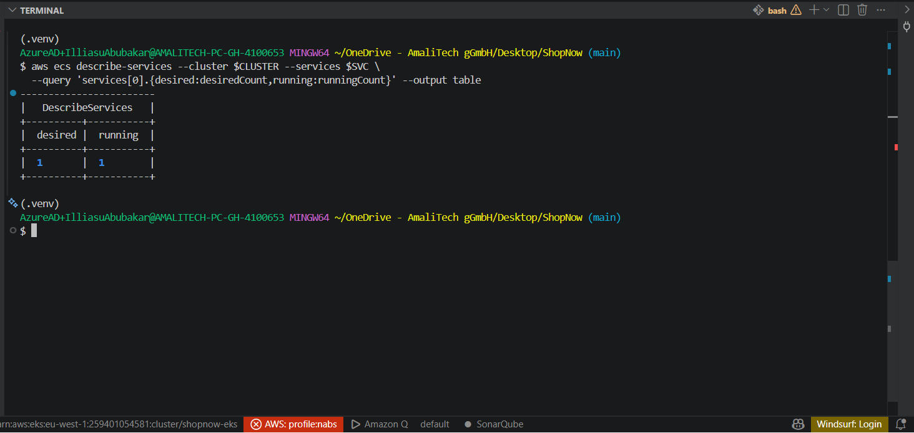
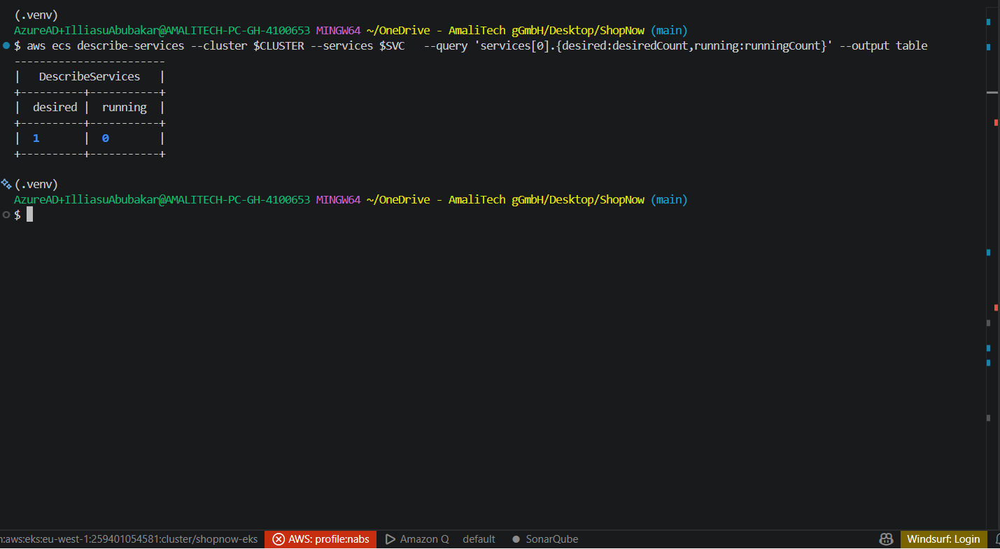
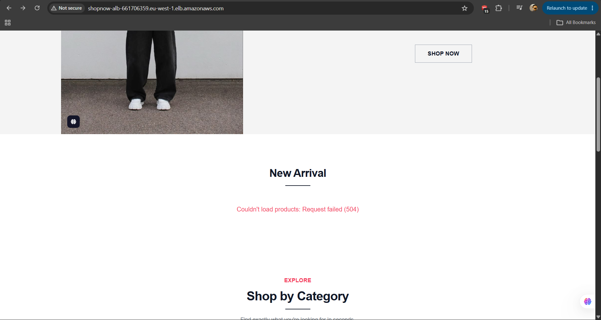
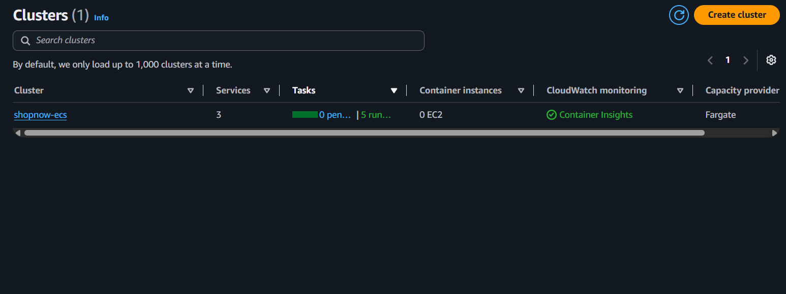
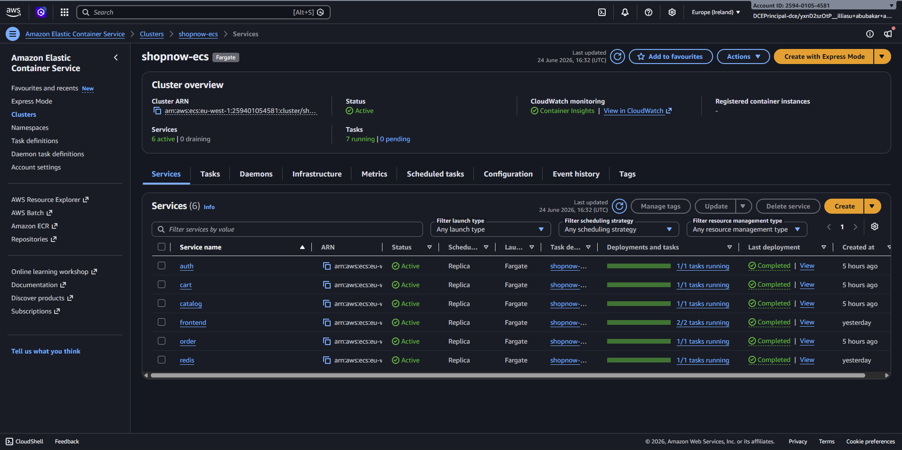
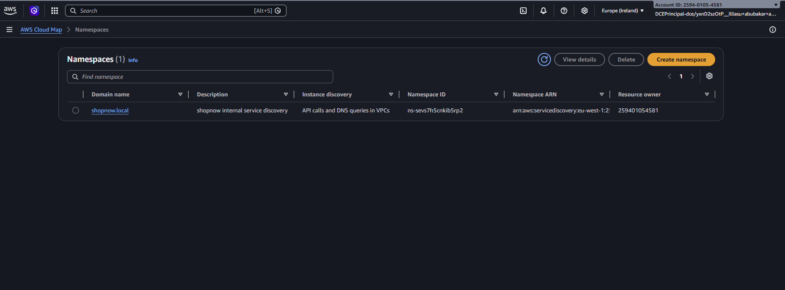

# ShopNow on Amazon ECS (Fargate)

> Live state captured from AWS (region `eu-west-1`, account `259401054581`).
> Screenshots referenced below live in `docs/screenshots/`.

## Overview

The ShopNow microservices run as **ECS Fargate** services behind the shared ALB
on the **`:80`** listener. Service-to-service traffic uses **AWS Cloud Map**
DNS; data is in the shared **RDS PostgreSQL** and an in-cluster **Redis** task.

- **App URL:** http://shopnow-alb-661706359.eu-west-1.elb.amazonaws.com/
- **Admin:** `admin@shopnow.com` / `Admin123!`

## Architecture

```
Internet → ALB shopnow-alb (:80 listener)
   ├─ /api/auth/*     → shopnow-auth-tg     → auth     task(s)
   ├─ /api/products/* → shopnow-catalog-tg  → catalog  task(s)
   ├─ /api/cart/*     → shopnow-cart-tg     → cart     task(s)
   ├─ /api/orders/*   → shopnow-order-tg    → order    task(s)
   └─ /               → shopnow-frontend-tg → frontend task(s)

Internal (Cloud Map, shopnow.local):
   cart  → http://catalog.shopnow.local:8000
   order → http://catalog.shopnow.local:8000, http://cart.shopnow.local:8000
   *     → redis.shopnow.local:6379, RDS endpoint:5432
```

## Live resource inventory

**Cluster** `shopnow-ecs` — ACTIVE, 7 running tasks, 6 services.

| ECS Service | Desired | Running | Status |
|---|---|---|---|
| auth | 1 | 1 | ACTIVE |
| catalog | 1 | 1 | ACTIVE |
| cart | 1 | 1 | ACTIVE |
| order | 1 | 1 | ACTIVE |
| frontend | 2 | 2 | ACTIVE |
| redis | 1 | 1 | ACTIVE |

**Launch type:** Fargate · **Container port:** 8000 (services), 80 (frontend)

**Service discovery** — Cloud Map private DNS namespace `shopnow.local`
(`ns-sevs7h5cnkib5rp2`), one registered service per ECS service.

**Load balancing** — ALB `shopnow-alb`, HTTP `:80` listener, path rules → one
target group per service (`shopnow-<svc>-tg`, target-type `ip`), all **healthy**.

**Data** — RDS `shopnow-postgres` (PostgreSQL 16.13, `db.t3.micro`, 20 GB,
single-AZ, **available**), databases `auth` / `catalog` / `orders`; Redis as an
ECS task.

**Images** — pulled from ECR: `shopnow-frontend`, `-auth`, `-catalog`, `-cart`,
`-order`.

## How it's deployed

Terraform (`infra/`): `network` (VPC) → `ecr` → `ecs-cluster` (cluster, ALB,
Cloud Map, IAM, per-service target groups + listener rules) → `rds` → four
`ecs-service` module instances + `redis` + `frontend`. A one-off `db-init`
Fargate task created the per-service databases; `seed` tasks loaded products +
the admin user.

## Resiliency (self-healing)

ECS maintains each service's `desiredCount`. Stop a task and ECS launches a
replacement automatically:

```bash
aws ecs stop-task --cluster shopnow-ecs --task <order-task-arn>
aws ecs describe-services --cluster shopnow-ecs --services order \
  --query 'services[0].{desired:desiredCount,running:runningCount}'
```

The ALB only routes to healthy targets, so traffic continues during recovery.

**Demonstration**

Before — service at desired count:



Task stopped — ECS detects the loss (running drops):



Recovered — ECS automatically launched a replacement task, back to desired count:



## Screenshots

### ECS cluster `shopnow-ecs`


### ECS services — desired = running


### Service discovery — Cloud Map `shopnow.local`


### Load balancing — shared ALB (`:80` ECS, `:8080` EKS)


> More optional captures (ECS tasks, target-group health, app in browser,
> resiliency before/after) can be added to `screenshot/` and embedded the same way.
