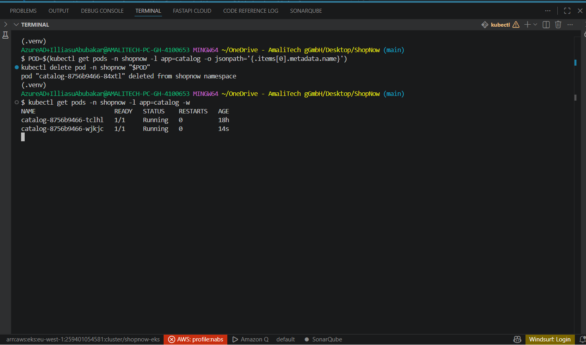
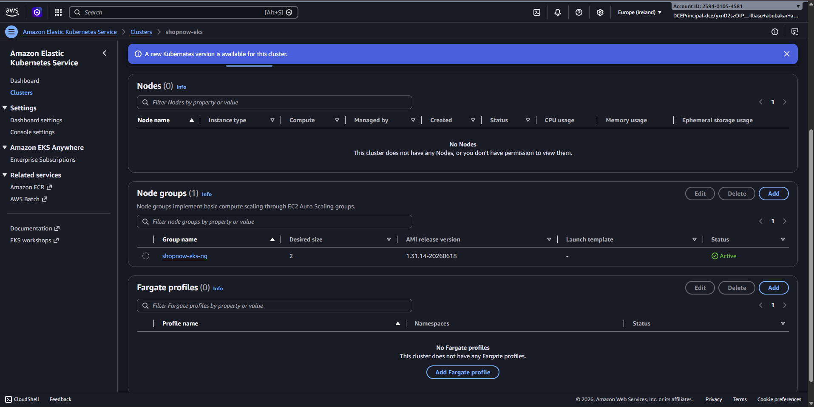
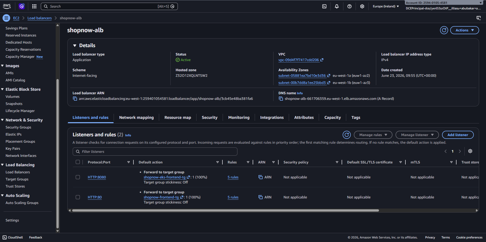

# ShopNow on Amazon EKS

> Live state captured from AWS (region `eu-west-1`, account `259401054581`).
> Screenshots referenced below live in `docs/screenshots/`.

## Overview

The same ShopNow microservices run on **Amazon EKS**, behind the **same ALB** as
ECS but on the **`:8080`** listener. Service-to-service traffic uses **CoreDNS**;
pods reach the **shared RDS** (same databases as ECS) and an **in-cluster
Redis**. Pods are attached to the shared ALB via **TargetGroupBinding** (AWS
Load Balancer Controller).

- **App URL:** http://shopnow-alb-661706359.eu-west-1.elb.amazonaws.com:8080/
- **Admin:** `admin@shopnow.com` / `Admin123!`

## Architecture

```
Internet → ALB shopnow-alb (:8080 listener)
   ├─ /api/auth/*     → shopnow-eks-auth-tg     → auth     pods
   ├─ /api/products/* → shopnow-eks-catalog-tg  → catalog  pods
   ├─ /api/cart/*     → shopnow-eks-cart-tg     → cart     pods
   ├─ /api/orders/*   → shopnow-eks-order-tg    → order    pods
   └─ /               → shopnow-eks-frontend-tg → frontend pods
        (pod IPs registered by the LB Controller via TargetGroupBinding)

Internal (CoreDNS, *.shopnow.svc.cluster.local):
   cart  → http://catalog:8000
   order → http://catalog:8000, http://cart:8000
   *     → redis:6379, RDS endpoint:5432
```

## Live resource inventory

**Cluster** `shopnow-eks` — **ACTIVE**, Kubernetes **v1.31**.

**Node group** `shopnow-eks-ng` — ACTIVE, **2× t3.medium** (managed, private
subnets), no health issues.

**Workloads** (namespace `shopnow`) — Deployments: auth, catalog, cart, order,
frontend (2 replicas each) + redis (1). All pods Running.

**Service discovery** — **CoreDNS**: services resolve by short name
(`catalog`, `cart`, `redis`) within the namespace.

**Load balancing** — **same ALB** `shopnow-alb`, HTTP **`:8080`** listener, path
rules → one target group per service (`shopnow-eks-<svc>-tg`, target-type `ip`).
All 5 EKS target groups report **2 healthy targets** each. Pods are registered
by the **AWS Load Balancer Controller** (installed via Helm) using
`TargetGroupBinding` (`k8s/bind-to-shared-alb.sh`).

**Data** — shared RDS `shopnow-postgres` (same `auth`/`catalog`/`orders`
databases as ECS; reachable via the `rds_from_eks` SG rule); Redis as an
in-cluster pod.

**Images** — same ECR images as ECS (`shopnow-*:latest`).

## How it's deployed

- **Terraform** (`infra/modules/eks`): EKS control plane, OIDC/IRSA, managed
  node group, core add-ons (vpc-cni, kube-proxy, CoreDNS), the LB-controller IAM
  role; plus the shared-ALB `:8080` listener + EKS target groups + SG rules.
- **Manifests** (`k8s/`): namespace, ConfigMap, Secret (per-service DB URLs +
  JWT key), Deployments + Services for the 5 apps + redis.
- **Bind step** (`k8s/bind-to-shared-alb.sh`): `TargetGroupBinding` per service →
  the controller registers pod IPs into the shared ALB target groups.

## Resiliency (self-healing)

The ReplicaSet maintains `replicas`. Delete a pod and Kubernetes recreates it:

```bash
kubectl delete pod -n shopnow <order-pod-name>
kubectl get pods -n shopnow -w
```

With 2 replicas per service, the ALB keeps serving from the surviving pod while
the deleted one is rescheduled — zero downtime.

**Demonstration** — the deleted pod goes `Terminating` while the ReplicaSet
creates a fresh one (`ContainerCreating → Running`), back to 2/2 automatically:



## Screenshots

### EKS cluster `shopnow-eks` (v1.31, node group 2× t3.medium)


### Load balancing — shared ALB (`:8080` listener for EKS)


> More optional captures (`kubectl get pods/targetgroupbindings -n shopnow`,
> EKS target-group health, app in browser on `:8080`, resiliency before/after)
> can be added to `screenshot/` and embedded the same way.
